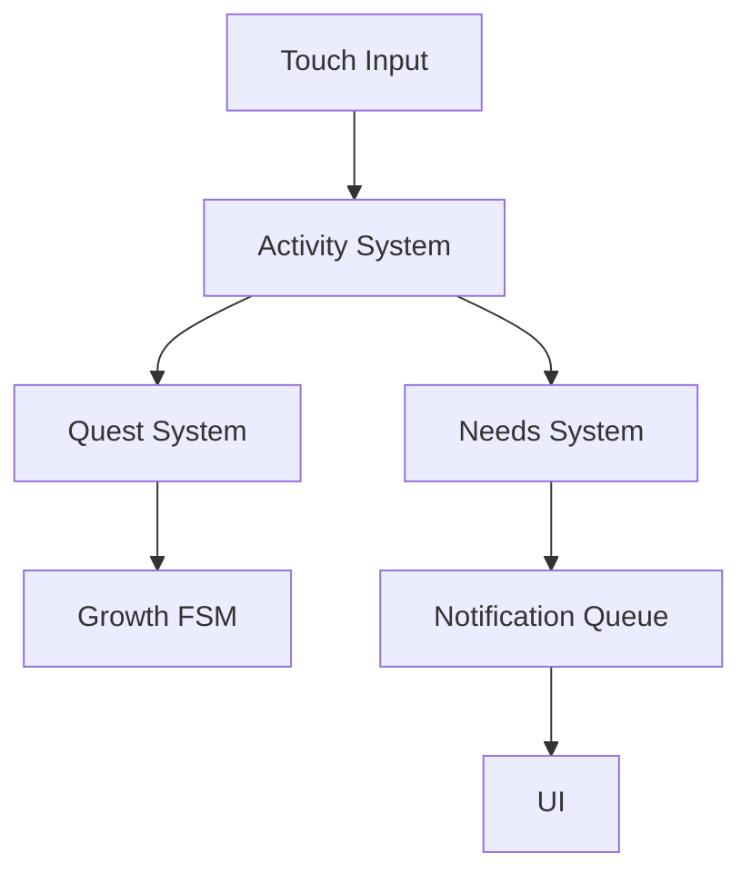

# ProjectJ40

> **Mobile-first life simulation built in Unity, focused on scalable gameplay architecture and system design.**

ProjectJ40 is a tamagotchi-inspired experience where the player takes care of a character that grows over time.  
The project is designed as a **WebGL mobile experience**, prioritizing touch interaction and modular systems.

---

## 🚀 Why This Project Matters

This project focuses on building **clean, extensible gameplay systems**, including:

- Finite State Machines for progression
- Data-driven quest systems
- Decoupled gameplay architecture
- Mobile-first interaction design (WebGL)

---

## 🎮 Core Gameplay

- Manage **Hunger, Sleep, and Fun**
- Perform activities through **touch interaction**
- Balance decaying stats over time
- Complete **quests** to unlock progression
- Discover new rooms and interactions as the character grows

---

## 🧠 Technical Highlights

- **Custom FSM (State Pattern)**
  - Interface-based (`IState`)
  - Clean state transitions
  - Easily extendable growth system

- **ScriptableObject Quest System**
  - `Quest` + `QuestStep` architecture
  - Action-based progression (not stat thresholds)
  - Data-driven and scalable

- **Queue-Based Notification System**
  - FIFO message handling
  - Prevents UI spam
  - Centralized feedback pipeline

- **Decoupled Systems**
  - Gameplay logic separated from UI
  - Modular communication between systems

---

## 📱 Mobile-First WebGL Design

This project is specifically designed to run on:

- Mobile browsers via **WebGL**
- Touch-based input only

### Key Design Decisions

- Large interaction targets for touch
- Minimal UI friction
- Short gameplay loops
- Lightweight systems for WebGL performance

---

## 🏗 Architecture Overview

---

## 🎯 Systems at a Glance

| System                | Responsibility                          |
|----------------------|----------------------------------------|
| Needs System         | Continuous stat simulation             |
| Activity System      | Player-driven stat changes             |
| Quest System         | Progression through actions            |
| Growth FSM           | Stage-based character evolution        |
| Notification System  | Controlled UI feedback (queue-based)   |

---

## ▶️ Playable Build

👉 https://desireenavarrete.itch.io/projectj40
*(Recommended on mobile devices)*

---

## 🎥 Media

---

## 🧪 What I Learned

- Designing **scalable gameplay systems**
- Implementing **FSM for progression**
- Building **data-driven architectures**
- Adapting gameplay to **mobile WebGL constraints**

---

## 🔗 Portfolio

👉 https://desireenavarrete.carrd.co/#WIP

---

## 🛠 Tech Stack

- Unity 2022.3.20f1
- C#
- Unity Input System
- WebGL (itch.io)
- Mobile-first design

---

## 🚧 Status

Early prototype focused on systems and architecture.

---

## 📄 License

All rights reserved.
