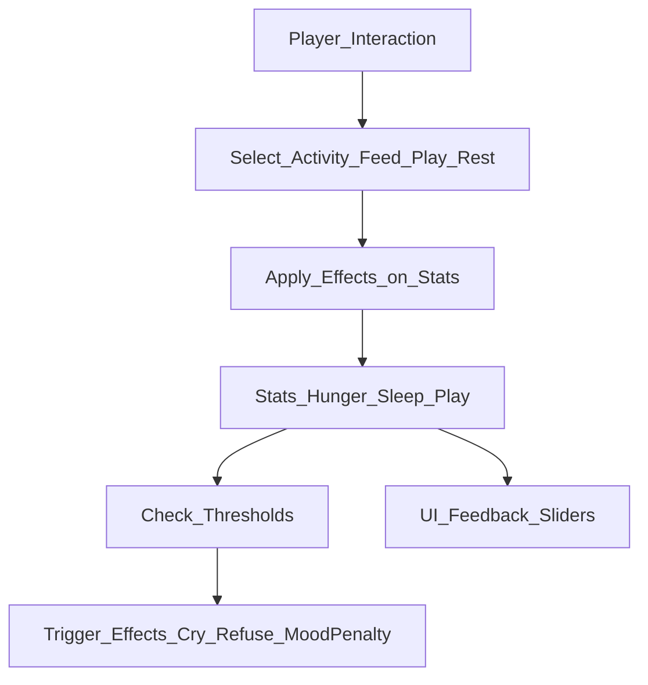

# Mechanics Overview

This document describes the core gameplay mechanics of the ongoing project.
Mechanics define how the player interacts with the game, how the character reacts,
and how needs evolve over time.

---

## Core Gameplay Loop

1. The player interacts with the character through touch-based input.
2. Activities (e.g., feeding, playing, resting) modify the character's stats.
3. Stats (Hunger, Sleep, Play) decay over time, requiring the player to manage them.
4. Thresholds in the stats trigger specific effects or feedback to the player.
5. Character growth or progression may occur over long-term milestones.

---

## Character Needs

### Stats
- **Hunger**: Decreases over time, increased by feeding actions.
- **Sleep**: Decreases over time, replenished by resting.
- **Play**: Decreases over time, replenished by playing activities.
<!--
Aqui hay que añadir mas cambios de stats
-->
### Update Logic
- Each stat is represented as a continuous numeric value (0–100).
- Values are updated every frame using a decay rate multiplied by a configurable factor.
- Player actions modify the stats immediately according to their effect.
- Effects from crossing thresholds (e.g., crying, refusing actions) are evaluated after each update.

---

## Activities

### Purpose
Activities represent short-term actions the player can perform with the character.

### Examples
- **Feeding**: Increases Hunger, may reduce Play slightly.
- **Resting**: Increases Sleep, temporarily limits Play actions.
- **Playing**: Increases Play, may reduce Sleep or Hunger slightly.

### Mechanics Notes
- Activities are only performed one at a time and are executed based on player input.
- Activity outcomes affect stats and trigger visual/audio feedback.

---

## Stat Threshold Effects
<!--
- Critical thresholds for each stat trigger feedback or constraints:
  - Hunger < 20 → Crying animation + sound
  - Sleep < 15 → Character refuses to play
  - Play < 10 → Mood penalty applied
  -->

- Threshold effects are managed separately from the UI.

---

## UI Feedback

- Stat values are reflected in sliders via the `StatView` component.
- Slider color changes when critical thresholds are reached:
  - Green: Normal
  - Red: Critical

- UI reacts to stat changes in real time, but does not affect the underlying gameplay logic.

---

## Player Interaction Summary

- Touch input is the primary control method.
- Interactions trigger activities which modify stats.
- Stats continuously decay and are evaluated for threshold effects.
- Player engagement is maintained by balancing the needs of the character.

---

## Notes

- Mechanics are currently in pre-production and may evolve as the project develops.
- The system is designed to be modular and extensible:
  - Additional activities or stats can be added easily.
  - Threshold effects can be expanded without modifying core logic.

