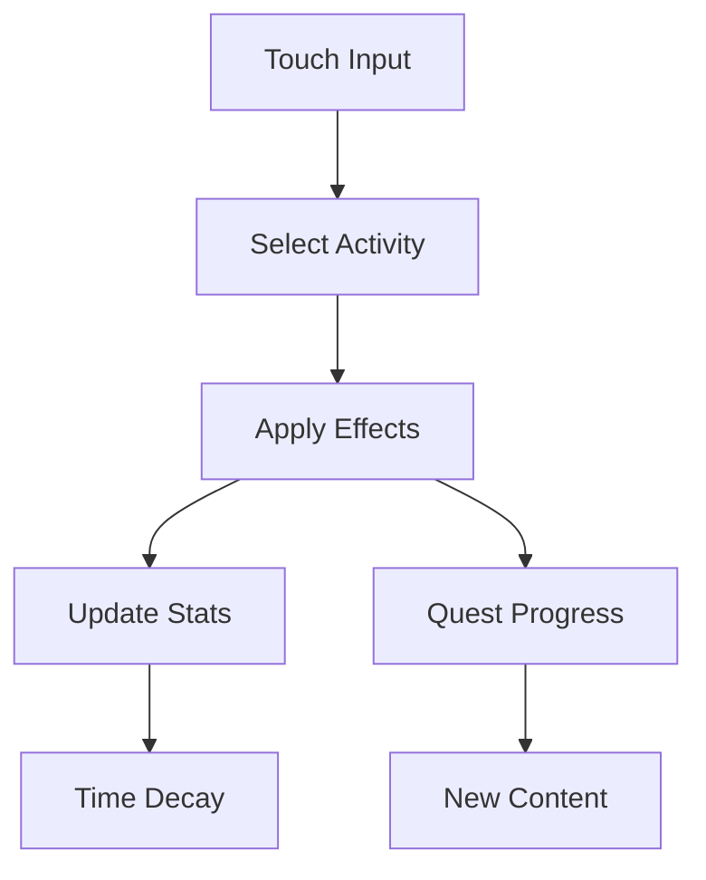

# Mechanics Overview

This document describes the **gameplay mechanics**, focusing on player interaction and game behavior.

---

## 🎮 Core Gameplay Loop

1. The player interacts using **touch input**
2. Selects an activity (feed, play, rest)
3. The activity modifies character stats
4. Stats decay continuously over time
5. The player maintains balance between needs
6. Completing quests unlocks new content

---

## 📊 Character Needs

### Stats

- **Hunger**
- **Sleep**
- **Fun**

### Behavior

- Range: 0–100
- Continuous decay over time
- Immediate response to player actions

---

## 👆 Touch-Based Interaction

- All gameplay is designed around **mobile touch input**
- Interactions are:
  - Direct (tap on objects)
  - Immediate (no complex UI navigation)

### Design Goals

- Minimize friction on mobile
- Keep interactions intuitive
- Support short play sessions

---

## 🎯 Activities

Activities are triggered through interaction with objects in rooms.

### Examples

- Feeding → restores Hunger
- Resting → restores Sleep
- Playing → restores Fun

### Notes

- Only one activity at a time
- Activities provide instant feedback
- Designed for quick interaction loops

---

## 🏠 Rooms & Interaction

- Game world is divided into **rooms**
- Each room contains interactive objects
- Objects define available activities

Example:
- Laboratory → tools that increase Fun

---

## 📈 Progression Mechanics

### Growth Stages

- Character evolves across stages
- Each stage unlocks new content

### Unlocks

- New rooms
- New interactions
- New activities

---

## 🎯 Quest-Driven Progression

- Quests are displayed in the UI
- Require **specific player actions**
- Completing quests advances progression

---

## 🎯 Player Experience Goals

- Encourage constant interaction
- Provide quick, satisfying feedback
- Support mobile-friendly gameplay loops
- Combine short-term and long-term goals

---

## 🔄 Gameplay Flow

---

## 📝 Notes

- Mechanics are optimized for **mobile WebGL gameplay**
- Systems support quick iteration and expansion
