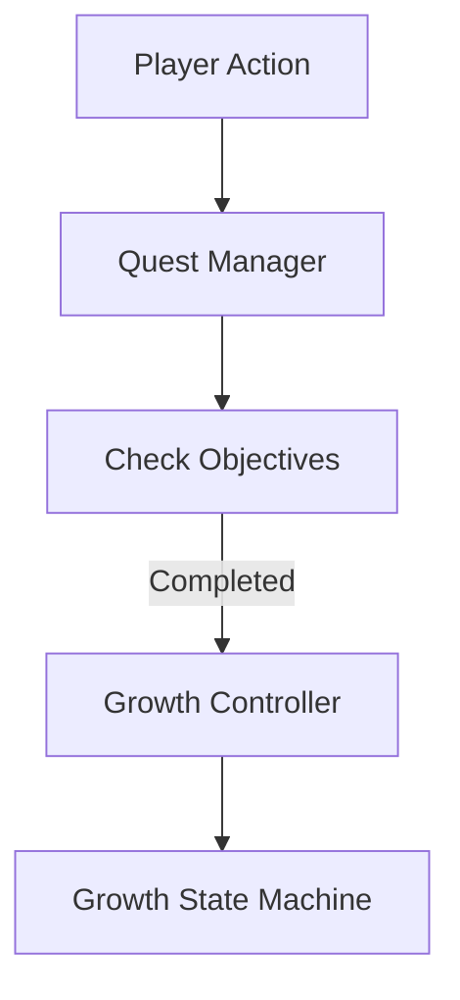
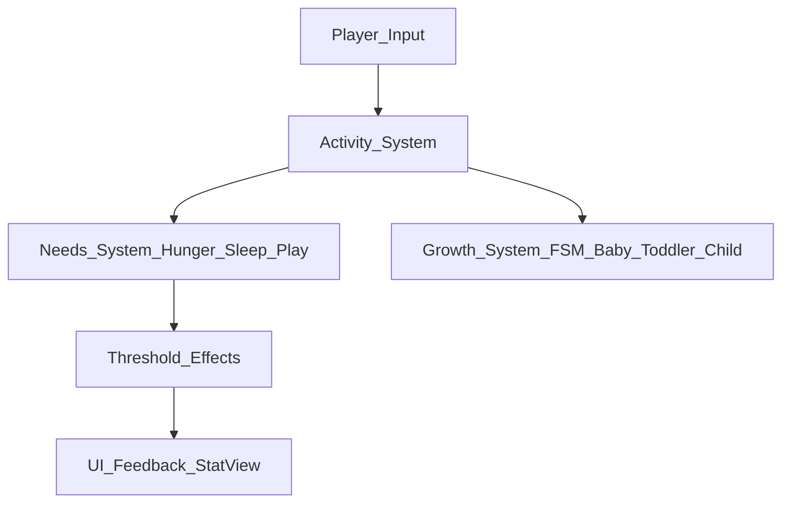

# Systems Overview

This document describes the core systems that govern character behavior, progression, and player interaction.
It explains how different systems interact, their responsibilities, and the architecture decisions behind them.

---
## Needs System

### Purpose
Manages continuous character needs using numeric values that decay over time and react to player actions.

### Core Needs
- **Hunger**
- **Sleep**
- **Play**

### Update Logic
- Each need is represented as a continuous numeric value (0–100).
- Values are updated every frame using a configurable decay rate.
- Player actions modify the stats immediately.
- Critical thresholds trigger effects (e.g., crying, refusal to play).

### Design Rationale
- Using continuous values allows multiple needs to evolve simultaneously.
- Provides smoother gameplay and flexible balancing.
- Decoupled from UI; visual feedback is handled separately by `StatView`.

---

## Player Interaction System

### Purpose
Handles player input and translates it into gameplay actions.

### Core Responsibilities
- Capture player input (touch-based)
- Validate player actions
- Trigger interactions with gameplay systems

<!--### Main Components
- `PlayerInputHandler`
- `InteractionController`-->

### Data Flow
1. Input is received through touch.
2. Input is validated based on current game state.
3. Corresponding interaction is triggered.
4. Gameplay systems (Needs, Character State) are updated accordingly.

---
<!--## Character State System

### Purpose
Maintains the current state of the character and ensures consistency between systems.

### Core Responsibilities
- Store character state (idle, sleeping, interacting, etc.)
- React to needs changes
- Coordinate animations and visual feedback

### Main Components
- `CharacterStateController`
- `CharacterStateData`

### Data Flow
1. Needs System triggers state-related events.
2. Character State System updates the current state.
3. Visual and animation systems are notified.
4. State changes may restrict or enable interactions.

---
### Threshold Effects

The Needs Manager evaluates each stat against defined thresholds.
When a stat falls below a critical value, a corresponding effect is triggered:
- Hunger < 20 → Cry animation + sound
- Sleep < 15 → Refuse to play
- Play < 10 → Mood penalty

These effects are managed separately from UI updates, keeping gameplay logic clean.

-->

## Growth System

### Purpose
Growth stages are defined through a shared enum used across systems (FSM, UI, gameplay logic and save system).  
This avoids tight coupling and allows the growth logic to scale cleanly.

### Core Responsibilities
- Define and manage character growth stages (e.g., Baby, Toddler, Child)
- Control transitions between stages
- React to long-term needs and milestones
- Persist current growth state

### Architecture
- Each growth stage represents a distinct state with its own rules and behavior.
- Implemented as a FSM with `GrowthStateMachine` and individual `GrowthState` classes.
- Future iterations may explore hierarchical states if complexity increases.

### Benefits
- Clear separation between growth stages
- Easy to add or modify stages without affecting existing logic
- Predictable and controlled transitions

---

## Activity System

### Purpose
Handles short-term character actions that the player triggers.

### Examples of Activities
- Feeding
- Resting
- Playing

### Mechanics
- Only one activity is active at a time.
- Activities modify the Needs System stats according to defined rules.
- Activity outcomes may trigger visual/audio feedback but do not directly change the stats logic.

---
## UI Separation

- All visual representations of stats are handled by `StatView`.
- Sliders update in real time based on stat values.
- Slider color changes indicate critical thresholds:
  - Green: Normal
  - Red: Critical

- Gameplay logic and visual feedback are clearly separated.

---

## Threshold Effects

- The Needs Manager evaluates each stat against critical thresholds:
  - **Hunger < 20** → Cry animation + sound
  - **Sleep < 15** → Refuse to play
  - **Play < 10** → Mood penalty
- Effects are managed by the system, not the UI.
- Threshold effects are modular and can be extended for additional stats or activities.

---

## Quest System

The Quest System controls character progression by defining structured objectives that the player must complete in order to trigger growth transitions.

Instead of automatic time-based evolution, character growth is now progression-driven. Each growth stage is unlocked by completing specific missions.

### Responsibilities

- Define mission objectives (e.g., feed X times, play Y times)
- Track mission progress
- Notify the GrowthController when conditions are met
- Trigger stage transitions in the Growth State Machine

### System Flow

## System Relationships Summary

- **Needs System** is the central driver of gameplay.
- **Player Interaction System** modifies needs and states.
<!--- **Character State System** ensures consistency and control flow.-->
- **Growth System** evaluates long-term progression.
- **UI System** reflects system state to the player.

---
Future iterations may explore hierarchical states if growth complexity increases.
---

## System Diagram (Conceptual)

## Notes

This document represents the current design during pre-production.
System responsibilities and data flow may evolve as gameplay is tested and iterated.
