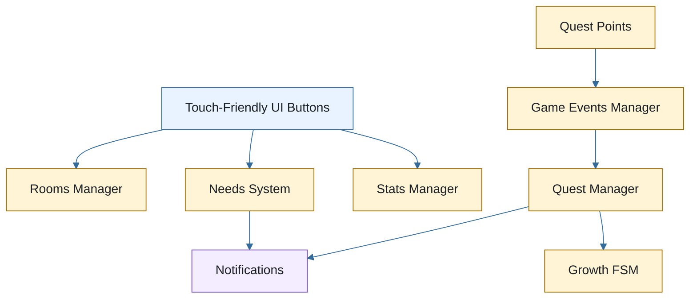

# ProjectJ40 / J4vi

> Mobile-first virtual pet prototype made in Unity, focused on gameplay systems, progression, and WebGL constraints.

ProjectJ40 is a Tamagotchi-inspired experience where the player takes care of Javi, a character that grows through different life phases. The project was built as a WebGL prototype for mobile browsers, using simple touch-friendly interactions and modular gameplay systems.

The main goal of the project is to show clean gameplay architecture in a small but complete prototype: stats, quests, growth phases, rooms, UI feedback, and player actions all work together to create a care loop.

---

## Playable Build

[Play ProjectJ40 on itch.io](https://desireenavarrete.itch.io/projectj40)

Recommended on mobile devices.

---

## Core Gameplay

- Take care of Javi by managing **Hunger**, **Sleep**, and **Play/Fun**.
- Use room actions such as eating, sleeping, playing, showering, or going to the bathroom.
- Complete quests to unlock growth progression.
- Move through different rooms: Kitchen, Lab, Bath, Dorm, and Entrance.
- Help Javi grow from Baby to Teen and Adult.

The gameplay is designed around short sessions, fast feedback, and large UI buttons that work well on mobile screens.

---

## Technical Highlights

### Custom Growth FSM

The growth system uses a small custom finite state machine. Each phase is represented by a state class:

- `BabyPhase`
- `TeenPhase`
- `AdultPhase`

This keeps phase-specific behavior separate and makes progression easier to extend.

### ScriptableObject Quest System

Quests are defined with `QuestInfoSO` assets stored under `Resources/Quests`. Each quest has:

- A display name.
- A level requirement.
- Optional prerequisite quests.
- One or more quest step prefabs.

Quest steps listen for player actions and advance the quest through a central event system.

### Stat and Needs Systems

The player manages three main stats:

- Hunger
- Sleep
- Play/Fun

Stats decay over time and are restored by room actions. Extra needs, such as bathroom and shower alerts, are handled through a dedicated notification flow.

### Room-Based UI

Rooms are controlled by `RoomsManager`. Each room activates its own set of actions and background color. New actions and rooms become available as Javi grows.

### Notification Feedback

The project includes two feedback channels:

- Text notifications for general UI messages.
- Need icons for urgent care alerts, such as bathroom or shower needs.

---

## Architecture Overview

---

## Tech Stack

- Unity `2022.3.20f1`
- C#
- Unity UI / UGUI
- ScriptableObjects
- DOTween
- LeanTween
- Shader Graph
- WebGL build target

---

## Project Structure

| Path | Purpose |
| --- | --- |
| `Assets/Scripts/Player` | Player, growth phases, and stat classes |
| `Assets/Scripts/FSM` | Custom state machine and `IState` interface |
| `Assets/Scripts/Systems` | Quest, rooms, needs, and global event systems |
| `Assets/Scripts/UI` | UI manager, notifications, buttons, and stat views |
| `Assets/Resources/Quests` | Quest assets and quest step prefabs |
| `Docs` | Technical and design documentation |

---

## Documentation

- [Systems Overview](Docs/systems.md)
- [Mechanics Overview](Docs/mechanics.md)
- [Design Decisions](Docs/DesignDecisions.md)

---

## Project Status

This is an early prototype focused on gameplay systems and architecture. It is not a final polished game, but it already shows the main care loop, quest progression, growth phases, and mobile-first UI structure.

---

## Portfolio

[Portfolio Website](https://desireenavarrete.carrd.co/#WIP)

---

## License

All rights reserved.
