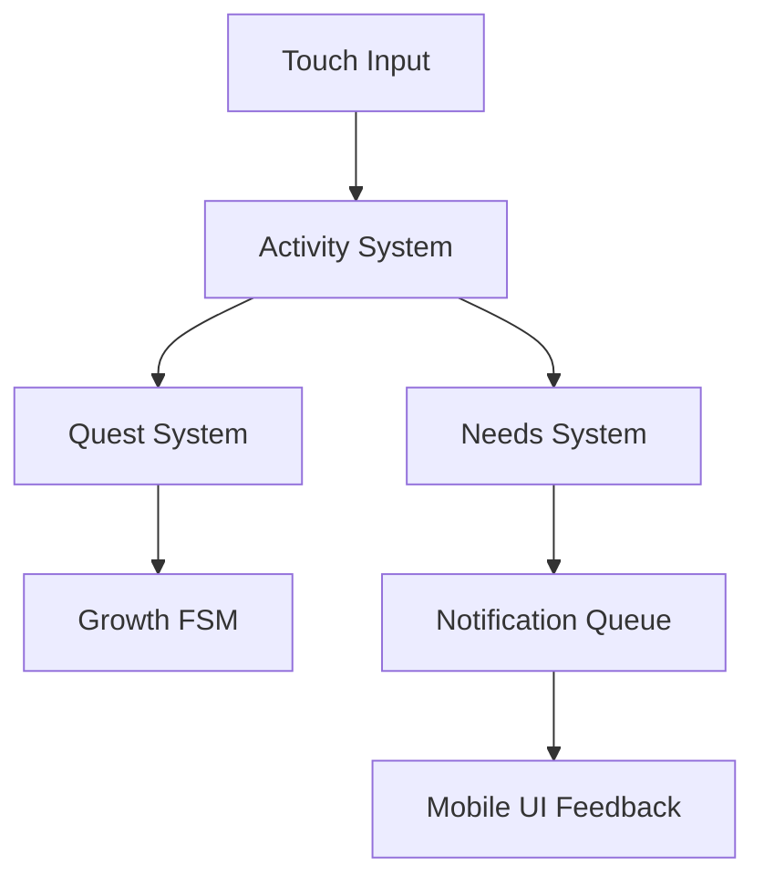

# ProjectJ40

**ProjectJ40** is an early-stage life simulation game inspired by tamagotchi-style experiences, designed specifically as a **mobile-first WebGL experience**.

The player takes care of a character whose needs evolve over time, interacting through touch-based input within a browser environment.

---

## 🎮 Core Concept

The player manages a character’s needs (Hunger, Sleep, Fun) while interacting with different rooms and objects.

- Stats decay over time
- The player performs activities to restore them
- Progression unlocks new rooms and interactions
- Growth stages reflect long-term engagement

---

## 📱 Mobile-First Design (WebGL)

This project is specifically designed to be played:

- On **mobile devices**
- Through a **WebGL build hosted on itch.io**
- Using **touch-based interactions only**

### Design Considerations

- Simple and readable UI for small screens
- Large interaction areas for touch input
- Short interaction loops suitable for mobile sessions
- Lightweight systems to ensure WebGL performance

---

## 🧠 Key Features

- **Needs System** with continuous stat decay
- **Finite State Machine (FSM)** for growth stages
- **ScriptableObject-driven Quest System**
- **Queue-based Notification System** to avoid UI spam
- **Modular Room & Interaction System**

---

## 🏗 Architecture Overview

---

## ⚙️ Technical Highlights

- Custom **State Machine** using `IState`
- **Data-driven quest system** with ScriptableObjects
- Clear separation between **gameplay and UI**
- Systems designed for:
  - Easy stat expansion
  - Modular content scaling
  - Mobile-friendly interaction

---

## 🎥 Media

Shows early system for hunger, energy, and happiness with quest progression  

---

## ▶️ Playable Build

Play the WebGL version (recommended on mobile):

👉 https://desireenavarrete.itch.io/projectj40

---

## 📱 Platform & Controls

- Platform: WebGL (itch.io)
- Target Device: Mobile browsers
- Input: Touch-based only

---

## 🚧 Project Status

**Early Prototype / Work in Progress**

Focused on building scalable gameplay systems.

> ⚠️ This build may contain bugs or incomplete features.

---

## 🧪 What I Learned

- Designing systems for **mobile-first interaction**
- Implementing **FSM-based progression**
- Building **scalable gameplay architecture**
- Creating **data-driven quest systems**

---

## 🔗 Portfolio

More details and screenshots:  
👉 https://desireenavarrete.carrd.co/#WIP

---

## 🛠 Technology

- Engine: Unity 2022.3.20f1
- Language: C#
- Input System: Unity Input System
- Platform: WebGL (itch.io)
- Target: Mobile browsers

---

## 📄 License

All rights reserved.
