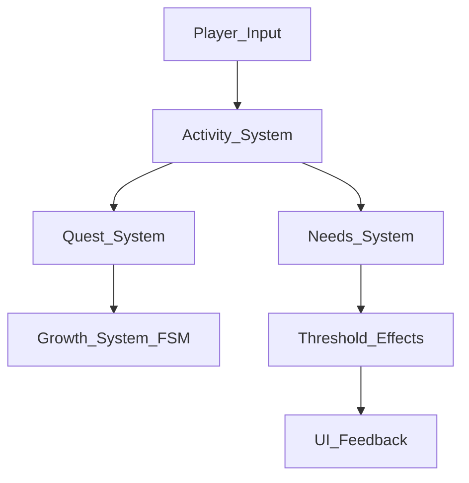

# ProjectJ40
This project is an early-stage life simulation game where the player takes care of a baby character whose needs change over time.  
The main goal at this stage is to design and test **core gameplay systems** before adding polish, content, or final art.

---

# Project Overview

---
## Current Development Focus
- **Needs System**: Tracks hunger, sleep, happiness, and other metrics.
- **Character Growth**: Baby evolves visually and mechanically over time.
- **Player Interaction**: Feeding, playing, and attending the baby’s needs.
- **Modular Architecture**: Core systems designed to scale as the game grows.

---

## Media

<!------>
<!---Shows the placeholder UI to control de stats, currently developing the needs system.--->
Shows early system for hunger, energy, and happiness with a quest system 

<!---
### Screenshots
<!---
--->

---
## Playable Build

A playable WebGL build is available on itch.io for testing and iteration purposes.

👉 Play it here: https://yourname.itch.io/project-name

---

## Platform & Controls

The project currently runs as a WebGL build on itch.io.  
It is primarily designed for mobile devices using touch-based interaction.

---

## Project Status

Early prototype / WIP focused on building and testing core gameplay systems.

> ⚠️ This build is an early prototype and may contain bugs or incomplete features.
## Technology
- Engine: Unity
- Language: C#
- Input: Unity Input System
- Target Platform: WebGL (itch.io)
- Primary Device: Mobile

<!---
## Assets & Credits
Some third-party assets used in this project are licensed under **Creative Commons CC0** (public domain).  
These assets are used for **prototyping purposes only**.--->

---

## License
All rights reserved.

This project and its contents are proprietary and may not be used, copied, modified, or distributed without explicit permission from the author.
